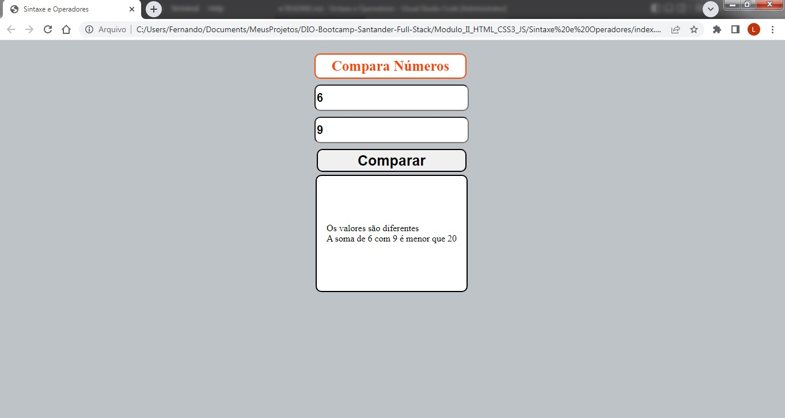

# Compara Números

Esse programa tem como objetivo comparar dois números e ver se eles são iguais ou diferentes e se sua soma é maior ou menor que 20.

* A entrada de valores só aceita números
* Programa impede o avanço sem todos dados serem preenchidos
* O Front End é responsivo

